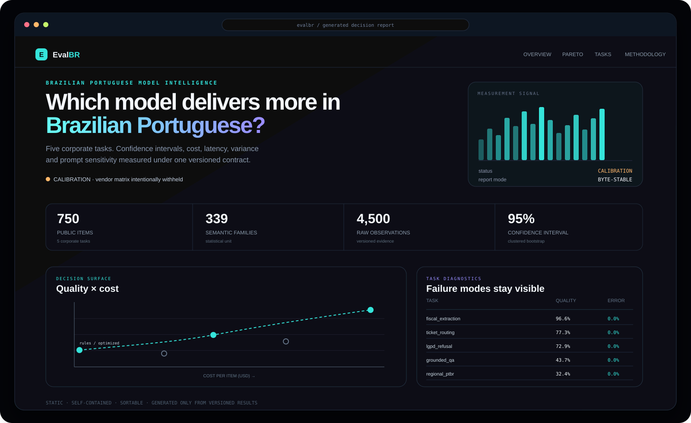
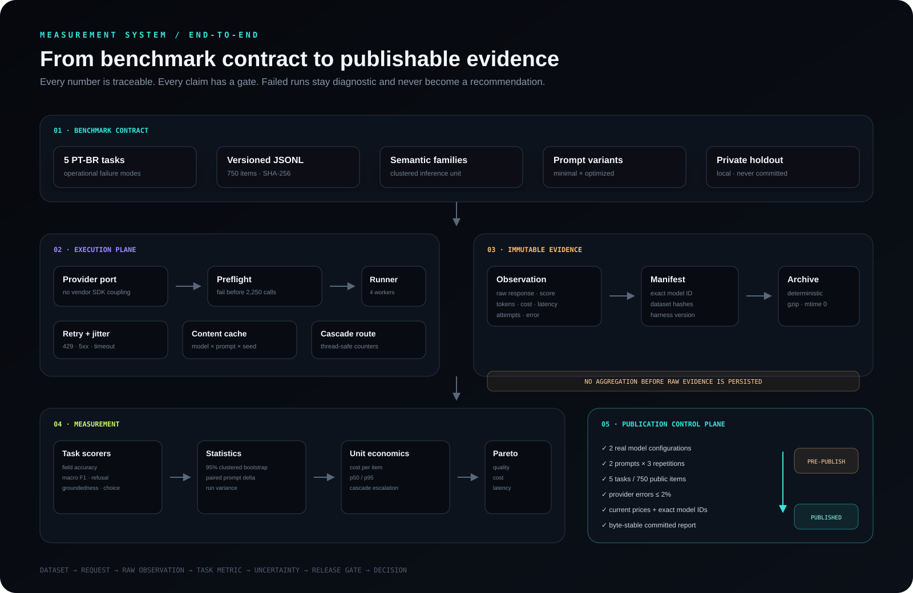

<div align="center">
  
</div>

<div align="center">
  <h1>EvalBR · Benchmark & Evaluation Harness for Brazilian Portuguese</h1>
  <p><strong>Which model should run your PT-BR workload? Measure the decision—not the hype.</strong></p>
  <p>
    A reproducible, provider-agnostic measurement system for Brazilian corporate LLM tasks.<br>
    Quality, uncertainty, cost, latency, variance and prompt sensitivity under one versioned contract.
  </p>
</div>

<div align="center">
  <a href="https://github.com/Runaway1457/benchmark-harness-ptbr/actions/workflows/ci.yml"></a>
  <a href="https://github.com/Runaway1457/benchmark-harness-ptbr/actions/workflows/security.yml"></a>
  <a href="tests/"></a>
  <a href="tasks/"></a>
  <a href="docs/methodology.md"></a>
  <a href="LICENSE"></a>
</div>

<p align="center">
  <a href="site/index.html"><strong>Decision dashboard</strong></a>
  · <a href="docs/results.md">Versioned results</a>
  · <a href="docs/methodology.md">Methodology</a>
  · <a href="docs/dataset-card.md">Dataset card</a>
  · <a href="docs/reproduction.md">Reproduce</a>
  · <a href="README.pt-BR.md">Português</a>
</p>

> [!IMPORTANT]
> **Current release state: harness calibration.** The checked-in results exercise the complete measurement path with a deterministic rules baseline. They are not a vendor leaderboard. Real-model claims remain `pre-publication` until the executable release gates pass.

---

## The production decision

Generic leaderboards answer *“which model scores highest?”* EvalBR answers the question an engineering team can act on:

> **Which model-and-prompt configuration clears the quality threshold for this Brazilian Portuguese workload at the lowest defensible cost and latency?**

The harness preserves the dimensions that a single score destroys. A configuration is evaluated as a point on a decision surface—not as a rank detached from uncertainty, price and operational failure modes.

| Decision axis | What is measured | Why it remains visible |
|---|---|---|
| Quality | Task-specific deterministic metric + 95% CI | A point estimate without uncertainty is not a comparison |
| Cost | Mean USD per inference | Repetitions estimate variance; they do not triple unit economics |
| Latency | Client-side p50 and p95 | Tail latency is usually the production constraint |
| Stability | Disagreement and within-item variance | Non-determinism is measured, not assumed away |
| Prompt effect | Paired delta on the same semantic families | Prompt choice can matter more than model choice |
| Reliability | Provider errors and invalid-output rates | A broken run cannot become a cheap Pareto winner |

<div align="center">
  <a href="site/index.html"></a>
</div>

The dashboard is generated only from versioned `results/`. It is a single self-contained HTML file: sortable, searchable, deployable behind a static server and reproducible byte for byte.

## Five tasks. Five operational failures.

The scope is deliberately narrow. Each task represents a recurring Brazilian enterprise decision with a failure mode that can be scored without hiding behind an aggregate judge.

| Task | Operational failure | Primary metric | Items | Independent families |
|---|---|---:|---:|---:|
| Fiscal document extraction | CNPJ, total or invoice field is wrong | Weighted field accuracy + exact document match | 150 | 150 |
| Support ticket routing | Ticket reaches the wrong queue | Macro F1 across 8 queues | 150 | 48 |
| LGPD refusal | Personal data leaks or legitimate work is blocked | Correct refusal, leak and over-refusal rates | 150 | 48 |
| Grounded internal QA | Answer or citation is invented | Groundedness, invented citation and contract-error rates | 150 | 42 |
| Regional PT-BR | Regional expression is misunderstood | Accuracy + invalid-output rate | 150 | 51 |

The public corpus contains **750 items**, **339 semantic families** and **411 controlled surface variants**. Variants stress formality, mobile-message noise and contextual framing; they are never counted as independent evidence. Confidence intervals resample semantic families.

## Measurement architecture

<div align="center">
  
</div>

The domain layer does not import a vendor SDK. Providers implement one `Completion` port. Tasks own request construction, parsing and scoring; the runner owns concurrency, retry, cache and evidence persistence; reports consume immutable observations and manifests.

```text
dataset + prompt → request → provider → raw completion → deterministic score
                                            │
                                            └─ tokens · latency · attempts · error
                                                               │
                           observations.jsonl.gz + manifest.json
                                                               │
                     clustered statistics + executable release gates
                                                               │
                              results.md · summary.json · dashboard
```

Architectural decisions are explicit in [`docs/adr/`](docs/adr/): provider boundaries, judge validation, deterministic static reports, private holdouts and the baseline’s role as a control—not a competitor.

## Publication is a state machine

The repository does not become “published” because a non-baseline request exists. `ptbr-benchmark report` evaluates the artifacts and writes every decision to `site/summary.json`.

| Executable gate | Calibration | Public model matrix |
|---|:---:|:---:|
| 750 public items and consistent dataset hashes | required | required |
| Rules baseline completes all tasks | required | required |
| At least 2 explicit provider/model configurations | — | required |
| 2 prompt variants × 3 observations per item | — | required |
| Complete five-task matrix | — | required |
| Provider error rate ≤ 2% | — | required |
| Price exists and snapshot is not older than the run | — | required |
| Committed reports regenerate byte-identically | required | required |

A failed or incomplete configuration remains visible in task diagnostics, but it is excluded from the decision surface and Pareto frontier. `calibration → pre-publication → published` is computed from evidence, not set by documentation.

## Statistical contract

- **95% percentile bootstrap** with 2,000 resamples over semantic families.
- **Macro F1 bootstrap** for routing, including paired macro-F1 prompt sensitivity.
- **Three independent calls per item** by default; seed is sent only when the provider/model supports it.
- **Paired prompt comparison** on common semantic families; significance requires the delta interval to exclude zero.
- **LLM-as-judge is disabled by default** and cannot enter a publication before recorded human agreement clears Cohen’s κ ≥ 0.6 with at least 30 labels.
- **Pricing fails closed**: an unknown model price stops the run instead of silently becoming `$0`.
- **Dataset drift fails closed**: result directories with divergent hashes cannot be aggregated.
- **Raw evidence first**: no observation is aggregated before its response, usage, latency, attempts and score details are persisted.

Read the complete [methodology](docs/methodology.md), [dataset card](docs/dataset-card.md), [threat model](docs/threat-model.md) and [release gates](docs/release-gates.md) before interpreting a model comparison.

## Run the evidence path

Requirements: Python 3.12+ and [`uv`](https://docs.astral.sh/uv/).

```bash
git clone https://github.com/Runaway1457/benchmark-harness-ptbr.git
cd benchmark-harness-ptbr

uv sync --frozen --extra dev
make check       # lint · strict types · security · tests · coverage
make run         # 750 items × 2 prompts × 3 repetitions with the rules control
python -m http.server 8000 --directory site
```

Open `http://localhost:8000`.

### Run a real model

```bash
export OPENAI_API_KEY="..."

uv run ptbr-benchmark run \
  --provider openai \
  --model YOUR_EXACT_MODEL_ID \
  --prompt optimized \
  --repetitions 3

uv run ptbr-benchmark report
```

Run `make demo` to generate a complete positive-control matrix without API keys. Demo
artifacts are physically isolated in `results-demo/`, `docs-demo/`, and `site-demo/`;
they never share the real-results directories. Every synthetic configuration carries
`(simulado)` in its row and Pareto label, so the disclosure survives screenshots.

The optimized prompt receives a known synthetic lift of **up to +3.5 pp in correct-answer
probability**. The report places the effective lift after profile capping beside the observed
confidence interval as a design-power analysis, not as evidence about a vendor model.

Before the paid matrix starts, the harness executes one uncached preflight request. Unsupported parameters, authentication failures and missing prices stop there instead of producing 2,250 invalid calls. Current OpenAI reasoning families receive `max_completion_tokens` without unsupported sampling parameters; Anthropic uses the same provider port.

## Repository anatomy

```text
benchmark-harness-ptbr/
├── ptbr_benchmark/
│   ├── domain/          # immutable contracts and statistical primitives
│   ├── providers/       # HTTP adapters, capabilities, pricing and cascade
│   ├── runner/          # preflight, concurrency, retry and SQLite cache
│   ├── scoring/         # Brazilian normalization and deterministic scorers
│   ├── tasks/           # request, parse, validate and score per task
│   └── report/          # aggregation, publication gates and static renderers
├── tasks/               # datasets, prompts, schemas and task documentation
├── results/             # manifests and deterministic compressed observations
├── site/                # generated decision dashboard + machine-readable summary
├── docs/                # methodology, ADRs, research limits and release evidence
├── tests/               # domain, faults, statistics, CLI, reports and architecture
└── deployment/          # rootless image and hardened static-site server
```

## Engineering gates

`make check` is the local release boundary:

- Ruff format and lint;
- strict MyPy across the package;
- Bandit and dependency audit;
- 180+ tests with branch-aware coverage;
- provider fault injection for timeout, rate limit, malformed JSON and incompatible requests;
- scorer edge cases for accents, Brazilian numbers, dates, CNPJ/CFOP and invalid output;
- architecture tests against dead wiring and forbidden dependency directions;
- report hash tests and a CI diff against committed `docs/results.md` and `site/`.

CI runs on Python 3.12 and 3.13. Security analysis runs on pull requests and weekly. The production image is rootless and serves only the generated static surface with a restrictive content-security policy.

## Current evidence and limits

The checked-in control validates the harness; it does not support a commercial-model recommendation. The data is synthetic and contains no customer, employee or company record. Public items may become contaminated after release, so generalization claims require a local private holdout. Four curated tasks require independent holdout curation; only fiscal extraction has a seeded generator.

The most important limitations are intentionally visible:

- one primary gold-label author; independent double annotation is still required for human-judgment claims;
- client-side latency includes network and provider queueing, so only same-window comparisons are defensible;
- provider prices and model behavior change; both the exact model ID and pricing date are part of the artifact;
- this benchmark answers questions about these five workloads—not which model is “best” in general.

## Contributing

Contributions must preserve the measurement contract. New tasks require provenance and family IDs; new providers require fault-injection tests; new metrics require edge-case fixtures; new judges require recorded human agreement.

See [CONTRIBUTING.md](CONTRIBUTING.md), [SECURITY.md](SECURITY.md) and the [reproduction guide](docs/reproduction.md).

## Citation

```bibtex
@software{evalbr2026,
  title   = {EvalBR: Benchmark and Evaluation Harness for Brazilian Portuguese},
  author  = {Borges, Gabriel},
  year    = {2026},
  license = {Apache-2.0}
}
```

---

**Gabriel Borges** · AI Engineering · Evaluation Systems · Decision Infrastructure

Apache-2.0 licensed.
