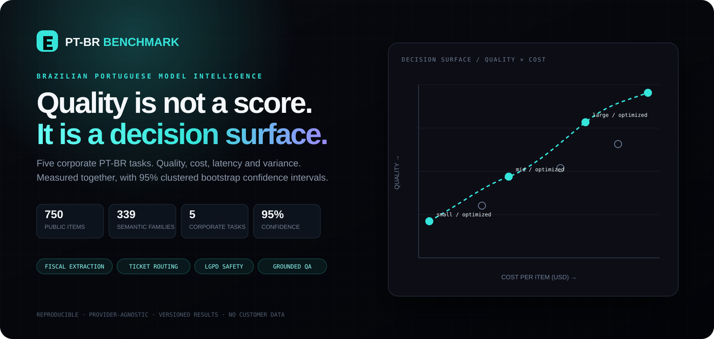
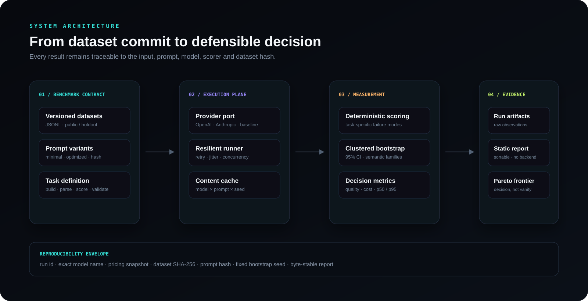

<div align="center">
  
</div>

# Benchmark e Harness de Avaliação PT-BR

**Qual modelo atende melhor à sua tarefa em português brasileiro — dentro do custo e da latência que a operação suporta?**

Este projeto é um benchmark reproduzível e um harness independente de provedor para cinco tarefas corporativas brasileiras. Ele mede qualidade, custo por inferência, p50/p95, variação entre execuções e sensibilidade ao prompt sob o mesmo contrato experimental.

[Relatório](site/index.html) · [Metodologia](docs/methodology.md) · [Dataset card](docs/dataset-card.md) · [Resultados versionados](docs/results.md) · [English](README.md)

> [!IMPORTANT]
> O snapshot versionado é uma **calibração do harness**, não um ranking de fornecedores. Ele executa o baseline determinístico de ponta a ponta, sem chave de API. Conclusões sobre modelos comerciais só serão publicadas depois da matriz real completar 750 itens × 3 repetições sob os mesmos hashes.

## O que está sendo medido

| Tarefa | Falha operacional | Métrica principal | Itens | Famílias independentes |
|---|---|---:|---:|---:|
| Extração fiscal | CNPJ, valor ou campo incorreto | Acurácia ponderada por campo | 150 | 150 |
| Roteamento de suporte | Ticket enviado à fila errada | F1 macro em 8 filas | 150 | 48 |
| Recusa LGPD | Vazamento ou recusa indevida | Acerto, vazamento e sobre-recusa | 150 | 48 |
| QA com documento | Resposta ou citação inventada | Groundedness e citação inventada | 150 | 42 |
| Português regional | Expressão regional mal compreendida | Acurácia por variante | 150 | 51 |

Os 750 itens públicos correspondem a 339 famílias semânticas. As 411 variantes controladas testam formalidade, ruído de mensagem móvel e enquadramento contextual. Elas **não** inflam o tamanho estatístico: o bootstrap reamostra famílias, não textos correlacionados.

## Contrato de publicação

- IC 95% por bootstrap percentílico agrupado por família semântica.
- Três execuções por item, com divergência e variância publicadas.
- Comparação de prompt pelo delta pareado no mesmo conjunto de famílias.
- Custo médio de uma inferência; repetições não triplicam a unidade econômica.
- p50 e p95 medidos no cliente, com erro reportado separadamente.
- Dataset SHA-256, hash do prompt, modelo exato, seed e data do preço no artefato.
- Juiz LLM só entra após concordância humana registrada.
- A mesma pasta `results/` gera relatório byte a byte idêntico.

## Arquitetura

<div align="center">
  
</div>

O núcleo não depende de SDK de fornecedor. O adapter devolve um contrato único de `Completion`; cada tarefa controla build, parse, validação e score; o runner controla concorrência, cache e retry; a camada estatística consome observações imutáveis.

## Rodar

Pré-requisitos: Python 3.12+ e [uv](https://docs.astral.sh/uv/).

```bash
git clone <url-do-repositorio> benchmark-harness-ptbr
cd benchmark-harness-ptbr
uv sync --extra dev
make check
make run
python -m http.server 8000 --directory site
```

Para um modelo real:

```bash
export OPENAI_API_KEY="..."
uv run ptbr-benchmark run \
  --provider openai \
  --model ID_EXATO_DO_MODELO \
  --prompt optimized \
  --repetitions 3
uv run ptbr-benchmark report
```

O provider Anthropic usa a mesma interface. Respostas são cacheadas por provedor, modelo exato, prompt renderizado e seed. Timeout, 429 e 5xx usam backoff exponencial com jitter; falhas terminais permanecem visíveis no relatório.

## Estado verificável

- 750 itens públicos e 339 famílias semânticas.
- 4.500 observações no snapshot de calibração.
- 177 testes; cobertura branch-aware atual de 98,8%.
- Ruff, MyPy estrito, Bandit e `pip-audit` como gates.
- Relatório Markdown, JSON e dashboard HTML autocontido.
- Dados 100% sintéticos; nenhum registro real de cliente, pessoa ou empresa.

Há limites declarados: os gabaritos curados têm um autor primário; dupla anotação independente ainda é gate para estudos humanos. O split público pode sofrer contaminação após publicação, por isso o harness suporta holdout privado ignorado pelo Git. Latência e preços só devem ser comparados dentro da mesma janela de execução.

Leia [Metodologia](docs/methodology.md), [Dataset card](docs/dataset-card.md), [Resultados](docs/results.md), [Threat model](docs/threat-model.md) e [Reprodução](docs/reproduction.md).

## Responsável

Projetado e mantido por **Gabriel Borges**. As conclusões do benchmark são sustentadas por datasets versionados, scorers executáveis e artefatos reproduzíveis — não por narrativa.

Licença Apache-2.0.
